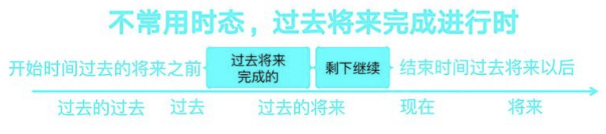

# 经典时态表

英语时态一共十六种，最常用的就六种。

| 状态时间 | 过去                          | 过去将来                                 | 现在                           | 将来                                |
| -------- | ----------------------------- | ---------------------------------------- | ------------------------------ | ----------------------------------- |
| 一般     | did 一般过去式                | would do 一般过去将来式                  | do 一般现在式                  | will do 一般将来式                  |
| 进行     | was/were doing  过去进行式    | would be doing 过去将来式                | am/is/are doing 现在进行式     | will be doing 将来进行式            |
| 完成     | had done 过去完成式           | would have done 过去将来完成式           | have done 现在完成时           | will have done                      |
| 完成进行 | had been doing 过去完成进行式 | would have been doing 过去将来完成进行式 | have been doing 现在完成进行式 | will have been doing 将来完成进行式 |

# 时间轴时态表

过去将来大致划分时间概念

具体时态精确划分时间表达

|           | -                             | -                              | 过去                                     | 现在          | 将来                                |
| --------- | ----------------------------- | ------------------------------ | ---------------------------------------- | ------------- | ----------------------------------- |
| 状态/时间 | 过去的过去                    | 过去                           | 过去的将来                               | 现在          | 将来                                |
| 一般      |                               | did 一般过去时                 | would do 一般过去将来式                  | do 一般现在式 | will do 一般将来式                  |
| 进行1     |                               | was/were doing 过去进行式      | would be doing 过去将来进行式            |               | will be doing 将来进行式            |
| 进行2     | had been doing 过去完成进行式 | have been doing 现在完成进行式 | would have been doing 过去将来完成进行式 |               | will have been doing 将来完成进行式 |
| 完成      | had done 过去完成式           | have done 现在完成时           | would have done 过去将来完成式           |               | will have done 将来完成式           |

# 现在时态

## 一般现代时

| 句式                                                         |                                                    |                                    |
| ------------------------------------------------------------ | -------------------------------------------------- | ---------------------------------- |
| 肯定                                                         | 主语为第三人称单数、动词第三人称单数，其他动词原形 |                                    |
| 否定                                                         | 主语+do/does+not+谓语动词原形                      |                                    |
| 疑问                                                         | 疑问句+do/does+主语+谓语动词原形                   |                                    |
| 现在发生的动作                                               | I love you                                         |                                    |
| 习惯发生的动作                                               | I usually drink water in the morning               |                                    |
| 描述客观事实                                                 | The earth goes round the sun                       | 地球围着太阳转                     |
| 谈论时间日程                                                 | The aircraft leaves at 9 o'clock                   | 这飞机在九点离开                   |
| 电影新闻比赛等的评论报道                                     | The film is quite different from the novel         | 这电影和小说不太一样               |
| 一般现在时表示将来，主句为将来时态或者表示将来的意思，时间/条件状语从句要用一般现在时表示将来 | I will tell him the news when he comes back        | 他回来的时候，我将告诉他这个消息。 |

## 现在进行时

> 

肯定：主语+be动词+动词现在分词

否定：主语+be动词+动词现在分词

疑问：疑问词+be动词+主语+动词现在分词

> 表示动作正在进行中，持续进行下去
>
> You are watching TV.

> 跟 always\constantly\forever\repeatedly 等频率词表示抱怨
>
> My girl friend is always complaining about ours house

> 现在进行时表示将来，表示已经安排好的事情
>
> My dad is taking me to class tomorrow
>
> 我爸明天带我去上课

## 有些动词不能用，现在进行式，要用一般现在式

| 分类 |                             |
| ---- | --------------------------- |
| 情感 | love hate prefer miss       |
| 归属 | have own want belong        |
| 感官 | see hear smell seem         |
| 思想 | think know believe remember |
| 测量 | fit contain consist analyse |

# 将来时态

## 一般将来时

## 

肯定：主语+will+动词原形

否定；主语+will+not+动词原形

疑问：疑问词+will+主语+动词原形

> 表示动作还没发生，将来可能发生
>
> I will buy a new car 我要买一辆新车

## 将来进行时

肯定：主语+will be +动词现在分词

否定：主语+will be + not +动词现在分词

疑问：疑问词+will be +主语+动词现在分词

> 表示动作在将来发生，发生后持续进行
>
> Alibaba users will be growing
>
> 阿里巴巴用户将持续增长

## 将来完成进行式

> 

肯定：主语 + will have been + 动词现在分词

否定；主语 + will have been + not + 动词现在分词

疑问：疑问词 + will have been + 主语 + 动词现在分词

表示动作在现在之后发生，动作在将来的一个时间点完成了一部分，动作仍然要继续发生下去并且对开始时间有影响。

> The paly is coming off in August. By then,the match will have been running for three months.
>
> 这个比赛要在八月暂停了，到哪个时候，他已经比了三个月了。

## 将来完成时

肯定：主语 + will have + 动词过去分词

否定：主语 + will have + not + 动词过去分词

疑问：疑问句 + will have + 主语 +动词过去分词

表示动作现在现在之后发生，动作在将来的一个时间点成，并且对开始时间有影响

> I will have reached Beijing.
>
> 我将抵达北京

# 过去时态

## 一般过去式

肯定：主语 + 动词过去式

否定：主语 + did + not + 动词原形

疑问： 疑问句 + did + 主语 + 动词原形

表示动作发生在过去，动作延续不延续不确定

> I learned English 
>
> 我学了英语

 

## 现在完成时

| 句式 |                                         |
| ---- | --------------------------------------- |
| 肯定 | 主语 + have/has + 动词过去分词          |
| 否定 | 主语 + have/has + not + 动词过去分词    |
| 疑问 | 疑问句 + have/has + 主语 + 动词过去分词 |

- 表示动作发生在过去，动作在过去已经完成了，对现在有影响

> I have finished my homework.
>
> 我已经完成了我的作业

- 可以和still、yet、already、always连用

> Have you finished your homework yet ?
>
> 你的作业完成了吗

- 讨论个人经历

> I have seen her this week
>
> 我这个星期见过她

- 表示动作发生在过去，动作一直在延续
- 可以和before、since、for、already、many times 、yet

> I have drive a car since 2009
>
> 我从2009年开始开车

## 过去完成式

| 句式 |                                    |
| ---- | ---------------------------------- |
| 肯定 | 主语 + had + 动词过去分词          |
| 否定 | 主语 + had + not + 动词过去分词    |
| 疑问 | 疑问词 + had + 主语 + 动词过去分词 |

- 表示动作发生在过去的过去，动作已经完成了，对过去有影响。

> I had lived in Nanjing before I moved to Kunming.
>
> 我搬到昆明前，我居住在南京

- 可以和after、as soon as、the moment tat、until 连用

> After she had got up, I cooked breakfast.
>
> 他起床后我做了早餐

## 过去完成进行时

| 句式 |                                          |
| ---- | ---------------------------------------- |
| 肯定 | 主语 + had been + 动词现在分词           |
| 否定 | 主语 + had been + not + 动词现在分词     |
| 疑问 | 疑问词 +  had been + 主语 + 动词现在分词 |

- 表示动作发生在过去的过去，动作在过去已经完成一部分，动作仍然要继续发生下去，对过去有影响

> She had been carrying out her plot to be the queen three months earlier.
>
> 早在三个月之前他就开始了自己的计划要成为女王

## 过去进行时

表示动作发生在过去，动作将持续下去

| 句式 |                                         |
| ---- | --------------------------------------- |
| 肯定 | 主语 + was/were + 动词现在分词          |
| 否定 | 主语 + was/were + not + 动词现在分词    |
| 疑问 | 疑问词 + was/were + 主语 + 动词现在分词 |

> The UFO was flying over my head last midnight
>
> 昨天夜里不明飞行物从我头顶飞过

## 现在完成时

表示动作发生在过去，动作持续进行下去，到现在已经完成了一部分，对现在有影响

| 句式 |                                          |
| ---- | ---------------------------------------- |
| 肯定 | 主语 + have been + 动词现在分词          |
| 否定 | 主语 + have been + not + 动词现在分词    |
| 疑问 | 疑问词 + have been + 主语 + 动词现在分词 |

> I have been working for seven days without a rest.
>
> 我已经连续工作七天没休息了

## 一般过去将来

表示动作发生在过去的将来，如果是人做主语表示意愿

.

| 句式 |                                          |
| ---- | ---------------------------------------- |
| 肯定 | 主语 + would +现在原型          |
| 否定 | 主语 + would + not + 动词原型      |
| 疑问 | 疑问词 + would + 主语 + 动词原型|

> I would win the match under cruel competition
> 我在残酷的比赛中获胜．

## 过去将来进行式

表示动作发生在过去的将来．动作一直持续下去

| 句式 |                                          |
| ---- | ---------------------------------------- |
| 肯定 | 主语 + would +   动词现在分词|
| 否定 | 主语 + would + not + 动词现在分词      |
| 疑问 | 疑问词 + would + 主语 + be + 动词现在分词 |

> When I was young, dad said I would be fighting for my future 20 years later。
> 在我小的时候，我爸跟我说20年后，我要为自己奋斗
