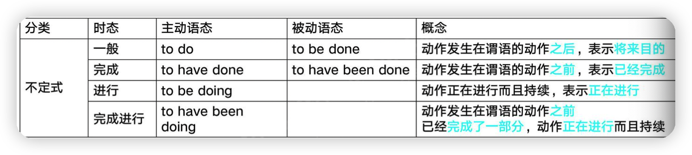

# 非谓语动词分类

不做谓语的动词：

- 不定式
- 动名词
- 现在过去分词

> The teacher told us to do homework.

> I like swimming

> He sat there reading a newspaper.

> We head about pulluted air information.

## 不定式

To + 动词不定式  或者 不加to 动词不定式

> I `like` to clean

> I `can` do it

### 不加to的情况

1. 跟助动词 
   1. can ,cloud , might ,should ,will , may ,must ,ought to ,shall ： `I can do it.`
2. 跟感官动词
   1. see, watch ,observer,hear,listen to ,feel 等：`I saw him enter the house` 我看他进入了房子
3. 跟使役动词
   1. Let,make,have,help,keep等：Let me try it
4. 跟why(not)
   1. Why not go out for a walk on a sunny day?
5.  跟know一起有时不加
   1. 若know为现在式，不定式是限于to be，这时候to不能省略
   2. We knew her to be honest 我们知道她是诚实的
   3. 若konw为过去式，或完成时，结构中不定式用除to be之外的其他动词不定式，这个时候可以省略 to
   4. We have never konw him tell a lie 我们从来不知道他在撒谎
6. 介词 except,but后面不加to
   1. She tries everthing except cook.:她尝试了做菜之外的全部事
7. 主语部分带do不定式做表语省略to
   1. All you do now is complete the form :你现在所要做的就是填好表格
8. 当两个或多个作用相同的不定式并列时，第一个不定式前用to，其余不定式前的to可以省略
   1. He told me to stay there an wait for him

###  什么时候要加

当使役动词、感官动词用于被动语态时，要补上在主动语态中省略的to

She was made to feel happy by the great news.

The woman was seen to enter a bank.

### 时态和语态

一般主动：I learn to play badminton 我学打羽毛球

一般被动：The cat likes to be petted 我喜欢被宠爱

完成主动：I learn to have played badminton 我学过打羽毛球

完成被动：The cat likes to have been petted by me 		

进行主动：I learn to be playing badminton 我正在学打羽毛球

完成进行：I learn to have been playing badminton 我一直学打羽毛球球

我觉得不错，今天看了JAVA核心技术卷2
