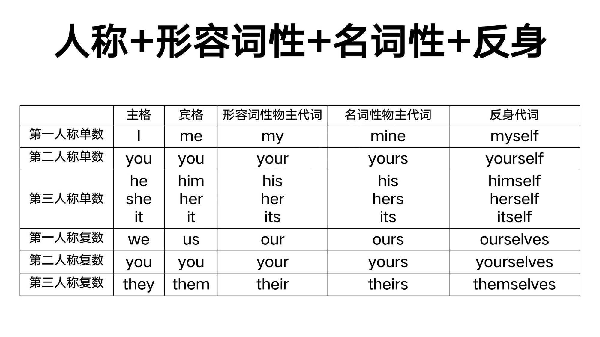
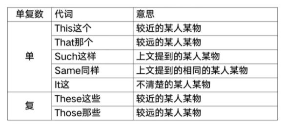
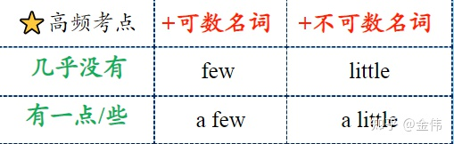
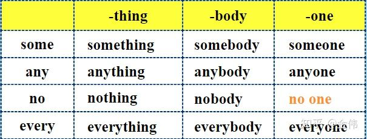
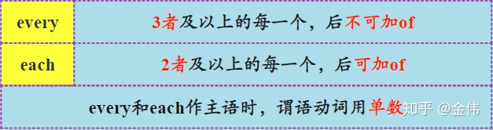
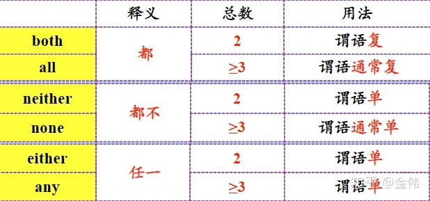
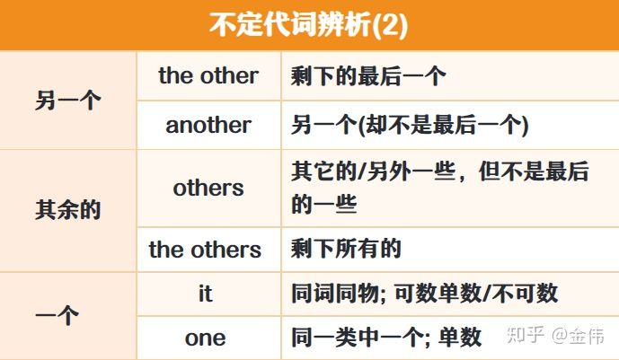
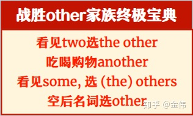

# 人称代词

- 主格有I,he, she,it, you, we,they
- 宾格有me, him, her, it, you, us



## 做主格

### 做主语

> `They are students`
>
> 他们是学生

### 做表语

> `It is you`
>
> 它是你

## 做宾格

### 及物动词之后的宾语

> `I tell her my name`
>
> 我告诉她我的名字

### 介词之后的宾语

> `I should apologize to her`
>
> 我应该向她道歉

## 顺序

一句中包含多个时,应按如下顺序介绍.

**第二人称(你)>>>第三人称(他)>>>第一人称(我)**

> `You and he and me are all students.`
>
> 你和他还有我都是学生

## It的用法

### 天气

> `It is cloudy`

### 时间

> `It is 6 o'clock`

### 距离

> `It is five miles`

### 环境

> `It is desert`(沙漠)

### 指上文提到的某物

> `I have a cute cat , and it have a blue eyes.`
>
> 我有一个可爱的猫,并且他的眼睛为蓝色

### 不知道性别的人

> `She has a cute baby, and it has blue eyes.`
>
> 她有一个可爱的宝宝,宝宝有蓝色的眼睛

### 已经发生的,正在发生的

> `Stop it`
>
> 停下

### 打电话分辨人

> `Hello ,Peter, It's Jack here`
>
> 你好,皮特,我是杰克

### 作形式主语

> `It is confident that he will win the match`
>
> 他有信心赢得比赛

### 做形式宾语

> `I realized It tough to learn ski well`
>
> 我意识到滑雪好难


# 物主代词

## 形容词性物主代词

做名词的修饰(的),后面加名词

> `She is my aunt`
>
> 她是我姑妈
>
> `They are their cars`
>
> 它们是他们的车

## 名词性物主代词

相当于名词,表示事物又表明所属

> `You are not mine`
>
> 你不是我的
>
> `Your house is huge ,but ours is rather small`
>
> 你的房子很大,但是我们的反正很小

## 双重所有格

of+名词性物主代词

> `He is a friend of mine`
>
> 他是我的朋友
>
> `An old friend of mine`
>
> 一个我的老朋友


# 反身代词

表示: 什么...自己

## 做宾语

指一个动作反馈到动作发生者身上

> `Stop! you might burn yourself`
>
> 停! 你有可能烧到你自己.

## 做同位语

表示强调,解释说明,强调名词或者代词

> `The book , itself is interesting.`
>
> 这本书本身很有趣


# 指示代词

说明近处远处,上下文的人或物




# 疑问代词

用来提出问题的代词,不分单复数,由修饰的名词做决定

| what      |      |
| --------- | ---- |
| who       |      |
| whose     |      |
| whom      |      |
| which     |      |
| whatever  |      |
| whichever |      |
| whoever   |      |
| whomever  |      |


# 不定代词

[来源](https://zhuanlan.zhihu.com/p/339893306)

## many mach

都是许多的意思

### many

修饰可数名词复数

### mach

修饰不可数名词

## `few .  a few . little . a little`



- 有 a 表示有剩余.无a无剩余

## `some . any`

### some 

常用于肯定句中

> 在表示建议,反问,请求的疑问句中,或者期望得到肯定回答时,多用`some`
>
> `Would you like some coffee?`

### any

常用于否定句和疑问句中

## 复合不定代词



- adj 修饰不定代词要后置: `something important`
- 复合不定代词按单数处理,如`someting`是指某一件事情,`somebody`是指某一个人

## `every & each`

意思:每一



## `both.all.neither.none.either.any`



## `other`







# 相互代词


# 关系代词


# 连接代词

```
a few  
I have a few apples;

few
I without few apples;

a little

more water a little 

little
```

